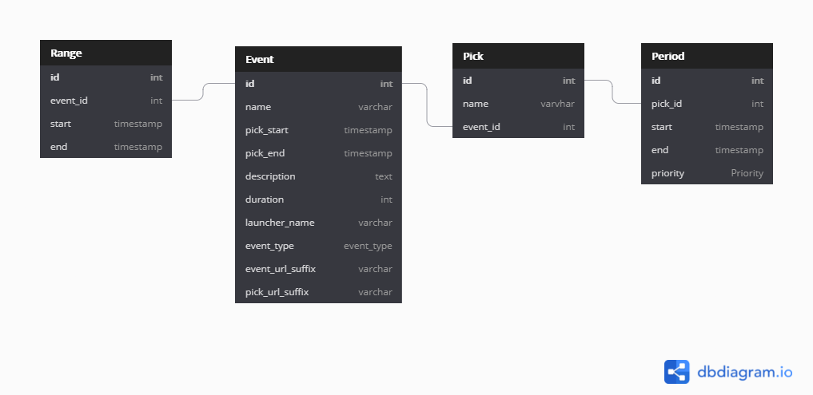

  

# Pickel

本專案為拖延已久之 程式導師實驗計畫第四期 Final Project，此處僅包含後端，專案規劃與前端 Repo 可以點擊下方連結

- 專案規劃網址：https://github.com/Lauviah0622/Pickel
- 前端 Repo：https://github.com/Lauviah0622/pickel-frontend
- 後端 Repo：https://github.com/Lauviah0622/pickel_backend

## 使用技術

- express
- Mysql 搭配 sequelize
- lodash
- dayjs
- dotenv
- jwt

### 開發環境工具

- nodemon
- husky
- eslint
- commitlink
- lint-stage

## 資料庫架構

https://dbdiagram.io/d/5fc34f173a78976d7b7dc932

